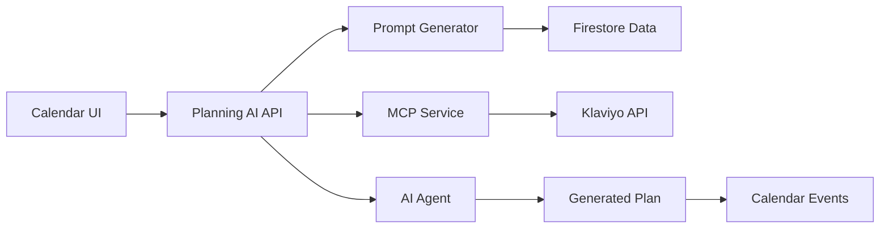

# Calendar Planning AI with MCP Integration

## Overview

The Calendar Planning AI system integrates MCP (Model Context Protocol) Klaviyo data with AI agents to generate comprehensive, data-driven campaign calendars. This system replaces manual planning with automated, intelligent calendar generation based on historical performance and real-time data.

## 🚀 Features

### Core Capabilities
- **Dynamic Prompt Generation**: Automatically pulls client-specific data from Firestore
- **MCP Integration**: Uses live Klaviyo data when available
- **AI-Powered Planning**: Generates 20 email + 4 SMS campaigns per month
- **Revenue Optimization**: Plans campaigns to meet monthly revenue goals
- **Segment Targeting**: Customizes campaigns for affinity segments
- **Historical Analysis**: Compares YoY performance for insights

### Components Added

#### 1. Backend Services

##### `app/services/calendar_planning_prompts.py`
Manages dynamic prompt templates with automatic variable replacement:
- Client name from Firestore
- Target month/year from calendar selection
- Affinity segments from client configuration
- Revenue goals from monthly targets
- MCP connector names from integration settings
- Key dates and events from calendar data

##### `app/services/admin_notifications.py`
Replaces Slack spam with organized admin notifications:
- Stores alerts in Firestore instead of Slack
- Provides severity levels (Info, Warning, Critical, Error)
- Includes acknowledgment system
- Auto-cleanup of old notifications

#### 2. API Endpoints

##### `app/api/calendar_planning_ai.py`
Main API for calendar planning operations:

| Endpoint | Method | Description |
|----------|--------|-------------|
| `/api/calendar/planning/ai/generate-plan` | POST | Generate comprehensive calendar plan |
| `/api/calendar/planning/ai/quick-analysis` | GET | Quick performance analysis |
| `/api/calendar/planning/ai/saved-plans/{client_id}` | GET | Retrieve saved plans |
| `/api/calendar/planning/ai/plan-details/{plan_id}` | GET | Get full plan details |
| `/api/calendar/planning/ai/apply-plan-to-calendar` | POST | Apply plan to calendar |

##### `app/api/admin_notifications.py`
Admin notification management endpoints:

| Endpoint | Method | Description |
|----------|--------|-------------|
| `/api/admin/notifications/` | GET | View notifications with filtering |
| `/api/admin/notifications/{id}/acknowledge` | POST | Acknowledge notification |
| `/api/admin/notifications/summary` | GET | Get notification statistics |
| `/api/admin/notifications/cleanup` | DELETE | Clean old notifications |

#### 3. Frontend Components

##### `frontend/public/components/CalendarPlanningAI.js`
React component for AI calendar planning interface:
- Month/year selection
- Revenue goal configuration
- Custom key dates management
- MCP data toggle
- Plan generation and application
- Saved plans browser

## 📋 Prompt Template Structure

The system uses a sophisticated prompt template that includes:

### 1. Connection Check
```
Connect to "{mcp_connector_name}" via MCP connector
Validate revenue metrics > 0 for comparison years
```

### 2. Data Requirements
- Campaign metrics (sends, opens, clicks, revenue)
- Segment performance analysis
- UTM source tracking
- Mobile vs desktop splits
- Time zone distributions

### 3. Planning Rules
- Send caps (max 2 emails/week standard)
- List health monitoring
- Promo vs nurture balance
- Revenue targets and distribution
- Affinity group mapping

### 4. Output Format
24-row campaign table with:
1. Week number
2. Send date/time
3. Segment targeting
4. Subject lines (A/B)
5. Content elements
6. CTAs and offers
7. Testing strategies
8. SMS variants

## 🔧 Configuration

### Firestore Data Structure

```
clients/
  {client_id}/
    - name: "Client Name"
    - klaviyo_account_id: "abc123"
    - timezone: "America/Los_Angeles"
    
    segments/
      affinity/
        - segments: ["Segment1", "Segment2"]
    
    goals/
      {year}_{month}/
        - revenue_target: 50000
    
    calendar_events/
      - date: "Sept 15"
      - title: "Product Launch"
      - description: "Notes"
    
    calendar_plans/
      {plan_id}/
        - month: "September"
        - year: 2025
        - ai_response: "..."
        - mcp_used: true
        - revenue_goal: 50000

mcp_clients/
  {client_id}/
    - connector_name: "Client Klaviyo"
    - status: "connected"
```

### Environment Variables

```env
# MCP Configuration
MCP_SERVER_URL=http://localhost:3000
MCP_API_KEY=your-mcp-key

# AI Agent Configuration
CLAUDE_API_KEY=your-claude-key
OPENAI_API_KEY=your-openai-key

# Firestore
GOOGLE_APPLICATION_CREDENTIALS=path/to/credentials.json
```

## 💡 Usage Examples

### Generate Calendar Plan

```javascript
// Frontend usage
const CalendarPlanner = () => {
    const [selectedClient, setSelectedClient] = useState('client_123');
    
    return (
        <CalendarPlanningAI 
            clientId={selectedClient}
            currentMonth="September"
            currentYear={2025}
            onPlanGenerated={(plan) => {
                console.log('Plan generated:', plan.plan_id);
                refreshCalendar();
            }}
        />
    );
};
```

### API Usage

```python
# Backend usage
import httpx

async def generate_plan_for_client(client_id: str, month: str, year: int):
    response = await httpx.post(
        "http://localhost:8000/api/calendar/planning/ai/generate-plan",
        json={
            "client_id": client_id,
            "month": month,
            "year": year,
            "use_mcp_data": True,
            "custom_revenue_goal": 75000
        },
        headers={"Authorization": f"Bearer {token}"}
    )
    return response.json()
```

### Quick Analysis

```bash
# Get quick insights
curl -X GET \
  "http://localhost:8000/api/calendar/planning/ai/quick-analysis?client_id=client_123&month=September&year=2025" \
  -H "Authorization: Bearer $TOKEN"
```

## 🚨 Order Monitoring Changes

### Disabled Slack Alerts
The order monitoring system was spamming Slack channels. We've disabled these alerts:

**Files Modified:**
- `app/api/performance.py` (lines 683-701): Commented out Slack webhook calls
- `app/services/order_monitor.py` (lines 340-370): Replaced Slack with admin notifications

### New Admin Notification System
Alerts now go to Firestore-based admin dashboard instead of Slack:
- View at `/api/admin/notifications/`
- Acknowledge important alerts
- Auto-cleanup after 30 days
- Severity-based filtering

## 🎯 Success Metrics

The system validates successful planning by:
1. **Revenue Goal Achievement**: Plans meet monthly targets
2. **Send Cap Compliance**: Stays within 2 emails/week limit
3. **Segment Coverage**: All affinity groups receive content
4. **Data Validation**: Non-zero revenue metrics confirmed
5. **MCP Connection**: Live data used when available

## 🔄 Integration Points

### With Existing EmailPilot Systems

1. **MCP Admin**: Manages Klaviyo connections
2. **OpenAPI**: Provides API documentation
3. **Klaviyo MCP**: Fetches live campaign data
4. **AgentService**: Executes AI planning
5. **Calendar Enhanced**: Displays generated plans
6. **Goals Management**: Sets revenue targets
7. **Client Management**: Provides client context

### Data Flow



## 🛠️ Troubleshooting

### Common Issues

1. **MCP Connection Failed**
   - Check MCP server is running
   - Verify client has valid Klaviyo API key
   - Confirm connector name matches configuration

2. **Zero Revenue Error**
   - Verify Klaviyo account has data for comparison period
   - Check metric ID is correct (default: TPWsCU)
   - Ensure date range has campaign activity

3. **Plan Generation Timeout**
   - Reduce number of campaigns requested
   - Check AI service quotas
   - Use quick analysis for faster results

4. **Missing Segments**
   - Configure affinity segments in Firestore
   - Set default segments if none specified
   - Check client document exists

## 📚 Related Documentation

- [EmailPilot README](README.md) - Main project documentation
- [MCP Integration Guide](MCP_INTEGRATION.md) - MCP setup details
- [Calendar System](CALENDAR_INTEGRATION_COMPLETE.md) - Calendar features
- [Admin Dashboard](ADMIN_DASHBOARD.md) - Admin interface guide

## 🔐 Security Considerations

1. **API Keys**: Stored in Secret Manager, never in code
2. **Authentication**: JWT tokens required for all endpoints
3. **Rate Limiting**: Prevents AI service abuse
4. **Data Validation**: Input sanitization on all endpoints
5. **Audit Logging**: All plan generations logged

## 📈 Performance Optimization

- **Caching**: MCP data cached for 15 minutes
- **Batch Processing**: Multiple campaigns generated together
- **Async Operations**: Non-blocking API calls
- **Database Indexes**: Optimized Firestore queries
- **Response Compression**: Gzip enabled for large plans

## 🚀 Future Enhancements

Planned improvements:
- [ ] Multi-language campaign support
- [ ] A/B test result integration
- [ ] Automated performance tracking
- [ ] Campaign template library
- [ ] Budget optimization algorithms
- [ ] Cross-channel coordination (email + SMS + push)
- [ ] Competitor analysis integration
- [ ] Seasonal trend detection

## 📝 Changelog

### Version 1.0.0 (2024-01-18)
- Initial implementation of Calendar Planning AI
- MCP integration for live Klaviyo data
- Dynamic prompt generation from Firestore
- Admin notification system replacing Slack
- Frontend component for plan management
- API endpoints for plan CRUD operations

---

*For questions or issues, please contact the EmailPilot development team or create an issue in the repository.*