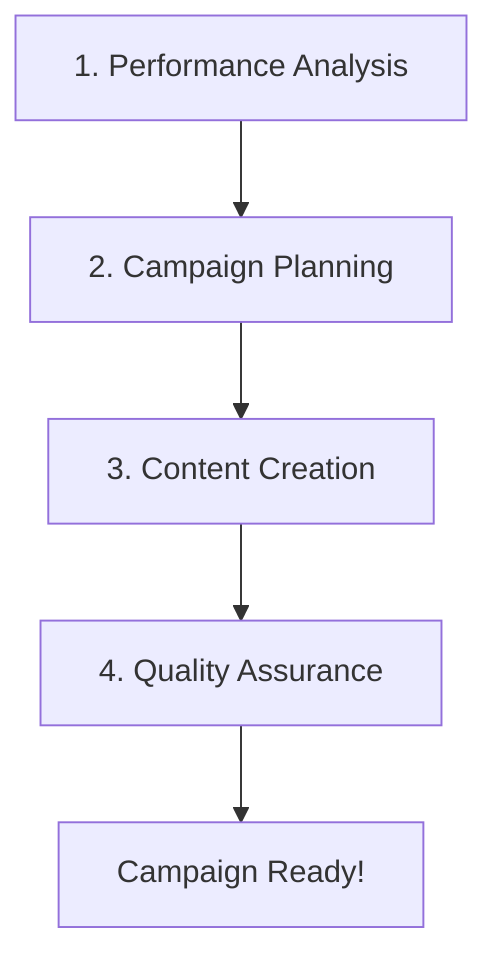

# 🎯 Multi-Agent Orchestrator Integration Guide

## How It Works

The Multi-Agent Orchestrator is a **workflow automation system** that coordinates specialized AI agents to create complete marketing campaigns. It operates in 4 distinct phases:



## 🔄 The Workflow Process

### Phase 1: Calendar Creation (Data Collection)
```
[Calendar Performance Agent] → Fetches metrics from Klaviyo/EmailPilot
[Calendar Strategist Agent] → Plans optimal send times and campaign types
```

### Phase 2: Brief Writing (Strategy)
```
[Brand Brain Agent] → Creates campaign brief with brand guidelines
[Human Approval Gate] → Optional manual review point
```

### Phase 3: Copywriting (Content)
```
[Copy Smith Agent] → Generates multiple copy variants (AIDA, PAS, etc.)
[Layout Lab Agent] → Creates design specifications
```

### Phase 4: Design & QA (Quality)
```
[Gatekeeper Agent] → Reviews for compliance and quality
[Truth Teller Agent] → Sets up analytics and KPIs
[Final Approval Gate] → Release checkpoint
```

## 🔌 Service Connections

The orchestrator connects to external services through **three integration patterns**:

### 1. Direct API Integration (Currently Stubbed)
The system is designed to connect to your existing services:

```python
# In your .env file:
EMAILPILOT_BASE_URL=http://localhost:8000  # Your EmailPilot instance
KLAVIYO_MCP_URL=http://localhost:9090      # Klaviyo MCP service
```

To connect these services, the agents need client implementations:

```python
# Example: apps/orchestrator_service/clients/emailpilot_client.py
import httpx
from typing import Dict, Any

class EmailPilotClient:
    def __init__(self, base_url: str):
        self.base_url = base_url
        self.client = httpx.AsyncClient()
    
    async def get_performance_data(self, brand_id: str, month: str) -> Dict[str, Any]:
        """Fetch performance metrics from EmailPilot"""
        response = await self.client.get(
            f"{self.base_url}/api/performance/{brand_id}",
            params={"month": month}
        )
        return response.json()
    
    async def get_brand_profile(self, brand_id: str) -> Dict[str, Any]:
        """Get brand guidelines and preferences"""
        response = await self.client.get(
            f"{self.base_url}/api/brands/{brand_id}"
        )
        return response.json()
```

### 2. MCP (Model Context Protocol) Integration
For Klaviyo data, you can use MCP servers:

```python
# Example: Connect to Klaviyo via MCP
class KlaviyoMCPClient:
    def __init__(self, mcp_url: str):
        self.mcp_url = mcp_url
    
    async def call_tool(self, tool_name: str, parameters: Dict[str, Any]):
        """Call MCP tool (e.g., get_campaigns, get_metrics)"""
        response = await httpx.post(
            f"{self.mcp_url}/tools/{tool_name}",
            json=parameters
        )
        return response.json()
```

### 3. AI Model Providers
The system uses multiple AI models for different tasks:

```python
# Configured in .env:
PRIMARY_PROVIDER=openai          # Analysis & strategy
PRIMARY_MODEL=gpt-4-turbo-preview

SECONDARY_PROVIDER=anthropic     # Fallback
SECONDARY_MODEL=claude-3-sonnet

MARKETING_PROVIDER=gemini        # Creative copy (less safety filters)
MARKETING_MODEL=gemini-2.0-flash
```

## 🛠️ How to Connect Your Services

### Step 1: Configure Endpoints
Edit `.env` file with your service URLs:

```bash
# Your services
EMAILPILOT_BASE_URL=http://your-emailpilot.com
KLAVIYO_MCP_URL=http://your-klaviyo-mcp.com
BIGQUERY_PROJECT=your-gcp-project
FIRESTORE_PROJECT=your-firestore-project
```

### Step 2: Implement Service Clients
Create client classes in `apps/orchestrator_service/clients/`:

```python
# klaviyo_client.py
class KlaviyoClient:
    async def get_campaign_performance(self, campaign_id: str):
        # Implement API call
        pass
    
    async def get_segment_data(self, segment_id: str):
        # Implement API call
        pass
```

### Step 3: Update Agent Nodes
Modify agents to use real data instead of mock data:

```python
# In apps/orchestrator_service/nodes/calendar_performance.py
async def fetch_performance(tenant_id, brand_id, selected_month):
    # Current: Returns mock data
    # TODO: Replace with:
    client = EmailPilotClient(settings.services.emailpilot_base_url)
    real_data = await client.get_performance_data(brand_id, selected_month)
    return PerformanceSlice(**real_data)
```

## 📊 Data Flow Example

```
1. User Request: "Create November campaign for Brand X"
   ↓
2. Orchestrator starts workflow
   ↓
3. Calendar Performance Agent:
   - Calls EmailPilot API → Gets last year's November metrics
   - Calls Klaviyo MCP → Gets current year performance
   ↓
4. Calendar Strategist Agent:
   - Uses GPT-4 to analyze data
   - Proposes campaign calendar
   ↓
5. Brand Brain Agent:
   - Fetches brand guidelines from EmailPilot
   - Creates campaign brief
   ↓
6. [Human Approval Point]
   ↓
7. Copy Smith Agent:
   - Generates copy using Gemini
   - Creates A/B test variants
   ↓
8. Layout Lab Agent:
   - Designs email structure
   - Specifies image requirements
   ↓
9. Gatekeeper Agent:
   - Checks compliance
   - Reviews quality
   ↓
10. Output: Complete campaign package saved to:
    multi-agent/.artifacts/{brand}/{month}/
```

## 🚀 Quick Start Integration

### Minimal Integration (Mock Mode)
```bash
# Works out of the box with mock data
AUTO_APPROVE_IN_DEV=true
python -m apps.orchestrator_service.main demo --month 2024-11 --brand test
```

### Basic Integration (Read-Only)
```python
# 1. Point to your EmailPilot instance
EMAILPILOT_BASE_URL=http://localhost:8000

# 2. The orchestrator will attempt to fetch:
GET /api/performance/{brand_id}?month=2024-11
GET /api/brands/{brand_id}
GET /api/calendar/{brand_id}
```

### Full Integration (Read-Write)
```python
# Additional endpoints needed:
POST /api/campaigns/create
POST /api/copy/variants
POST /api/designs/specifications
POST /api/analytics/setup
```

## 🔧 Available Integration Points

### Input Sources (Where data comes from)
- **Performance Metrics**: Historical campaign data
- **Brand Profiles**: Guidelines, tone, preferences  
- **Customer Segments**: Audience definitions
- **Product Catalogs**: Items to feature
- **Calendar Events**: Holidays, sales, launches

### Output Destinations (Where results go)
- **Campaign Briefs**: Strategic documents
- **Copy Variants**: Email text, subject lines
- **Design Specs**: Layout requirements
- **Asset Requirements**: Image/video needs
- **QA Reports**: Compliance checks
- **Analytics Plans**: KPI definitions

## 📡 Service Status Check

Run this to verify connections:

```python
# Test your service connections
python -c "
from apps.orchestrator_service.config import get_settings
import httpx

settings = get_settings()

# Test EmailPilot
try:
    resp = httpx.get(f'{settings.services.emailpilot_base_url}/health')
    print(f'✓ EmailPilot: {resp.status_code}')
except:
    print('✗ EmailPilot: Not reachable')

# Test Klaviyo MCP
try:
    resp = httpx.get(f'{settings.services.klaviyo_mcp_url}/health')
    print(f'✓ Klaviyo MCP: {resp.status_code}')
except:
    print('✗ Klaviyo MCP: Not reachable')
"
```

## 🎨 Customization Options

### Add Custom Agents
```python
# apps/orchestrator_service/nodes/your_custom_agent.py
async def your_custom_agent(input_data):
    # Your logic here
    return processed_data
```

### Modify Workflow
```python
# apps/orchestrator_service/graph.py
# Add new nodes, change routing, adjust approval gates
```

### Change AI Models
```python
# Per-agent model selection
# In each node file, specify which model to use
model_config = settings.get_model_config("marketing")  # or "analysis"
```

## 🔍 Debugging Integration

### View Current Configuration
```bash
python -c "from apps.orchestrator_service.config import get_settings; s=get_settings(); print(s.to_dict())"
```

### Test Individual Agents
```python
# Test a single agent in isolation
from apps.orchestrator_service.nodes import calendar_performance

result = calendar_performance.fetch_performance(
    tenant_id="test",
    brand_id="test-brand", 
    selected_month="2024-11",
    prior_year_same_month="2023-11"
)
print(result)
```

### Monitor Workflow Execution
```bash
# Enable debug logging
LOG_LEVEL=DEBUG python -m apps.orchestrator_service.main demo --month 2024-11 --brand test
```

## 📈 Production Deployment

### Environment Variables for Production
```bash
ENVIRONMENT=production
GOOGLE_CLOUD_PROJECT=your-prod-project
AUTO_APPROVE_IN_DEV=false  # Require human approvals
ENABLE_TRACING=true        # OpenTelemetry monitoring
```

### Service Discovery
```python
# Use environment-specific URLs
EMAILPILOT_BASE_URL=${EMAILPILOT_SERVICE_URL:-http://emailpilot:8000}
KLAVIYO_MCP_URL=${KLAVIYO_SERVICE_URL:-http://klaviyo-mcp:9090}
```

### Health Checks
```bash
# Orchestrator health endpoint
GET http://localhost:8100/health

# Should return:
{
  "status": "healthy",
  "environment": "production",
  "timestamp": "2024-11-01T10:00:00Z"
}
```

## 🤝 Getting Help

1. **Check the README**: `/multi-agent/README.md`
2. **View API docs**: http://localhost:8100/docs (when server is running)
3. **Test individual components**: Use the test scripts in `/multi-agent/tests/`
4. **Enable debug mode**: Set `LOG_LEVEL=DEBUG` for detailed output

---

**Remember**: The orchestrator is designed to be modular. You can:
- Start with mock data (no integration needed)
- Add services incrementally (one at a time)
- Replace any agent with your custom implementation
- Use any combination of real and mock data

The system will gracefully handle missing services and continue with available data.